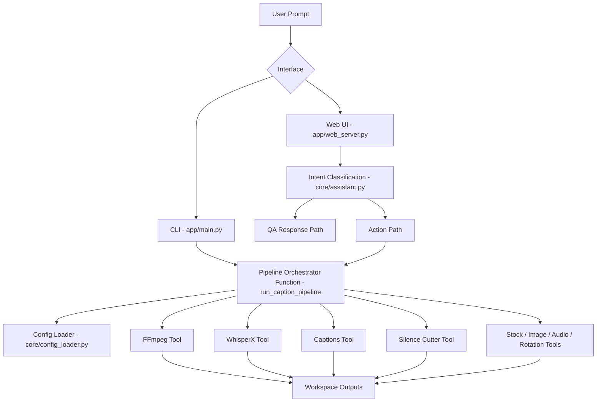

# Gennio

Gennio is a local AI-powered video editing assistant that combines deterministic media tools (FFmpeg + custom Python tooling) with LLM-assisted intent routing.

It supports end-to-end workflows such as captioning, silence/filler cutting, stock footage compositing, transitions, rotation, and media utility operations via CLI and web UI.

## Highlights

- Automatic transcription with word-level timestamps (`faster-whisper`)
- Styled ASS caption generation with optional per-word/progressive highlighting
- Silence + filler-word cutting (English/Arabic/code-switched)
- Stock footage workflows (overlay and insert)
- Transition support via FFmpeg `xfade` / `acrossfade`
- Media rotation for videos and images
- Image-to-video conversion for image-first workflows
- FastAPI web studio with upload/session chat and timeline helper pages
- Local QA assistant with vector-memory retrieval over project knowledge

## Current Architecture



## Tooling Matrix

| Tool ID | Purpose | Status in Main Runtime |
|---|---|---|
| `ffmpeg` | audio extract, media info, subtitle burn, transitions | active |
| `whisperx` | transcription + word timestamps | active |
| `captions` | ASS subtitle generation | active |
| `silence_cutter` | silence/filler/manual cut workflows | active |
| `rotate_media` | image/video rotation | active |
| `stock_footage` | stock overlay/insert | active |
| `image_overlay` | direct image compositing | active (also used via stock-image routing) |
| `image_to_video` | convert static image to video canvas | active |
| `text_overlay` | styled text overlays | implemented |
| `background_audio` | mix/insert background audio | implemented |

## Repository Layout

```text
.
├── app/                  # CLI + FastAPI web server entrypoints
├── core/                 # assistant, config loading, orchestration primitives, recipes, memory
├── tools/                # media processing tools
├── configs/              # runtime config files
├── registry/             # tool and config registries
├── prompts/              # system and assistant prompt templates
├── recipes/              # declarative recipe definitions
├── presets/              # caption style presets
├── tests/                # unit/integration tests
├── web/                  # frontend assets/pages
├── workspace/            # generated runtime artifacts
└── requirements.txt
```

## Prerequisites

- Python 3.10+
- FFmpeg available in `PATH`
- (Optional but recommended) GPU-enabled PyTorch for faster ASR
- Ollama (for local assistant/chat capabilities)

## Installation

```powershell
# from repository root
python -m venv .venv
.\.venv\Scripts\Activate.ps1
python -m pip install --upgrade pip
pip install -r requirements.txt
```

## Configuration

Create/update `.env` for model routing and assistant behavior.

Common variables:

- `OLLAMA_MODEL`
- `EDITBOT_HEAD_MODEL`
- `EDITBOT_QA_MODEL`
- `EDITBOT_IMPLEMENTATION_MODEL`
- `EDITBOT_REASONING`
- `EDITBOT_MODELS_DIR` (optional override for local model cache directory)
- `EDITBOT_FFMPEG_DIR` (optional fallback folder containing `ffmpeg.exe`)

If `EDITBOT_MODELS_DIR` is not set, models are cached under `./.models` relative to the repo.

## Running

### CLI

```powershell
python -m app.main --interactive
```

Single command example:

```powershell
python -m app.main -v .\input.mp4 -p "remove silence, add cross dissolve transitions, then add yellow captions"
```

### Web Studio

```powershell
python -m app.web_server
```

Then open `http://127.0.0.1:8000`.

## Example Prompts

- `Add captions with white text, yellow highlight, and bold current word`
- `Cut from 18.005 to 18.670, then add captions`
- `Add stock footage from 25.7s to 29s from C:\clips\broll.mp4`
- `Rotate right twice and export`
- `What is the video duration and fps?`

## Testing

```powershell
$env:PYTHONPATH='.'
pytest -q
```

## Notes for Contributors

- Use relative paths and `Path(...)` joins; avoid machine-specific absolute paths.
- Prefer updating tool metadata in `registry/tools.json` when adding tools.
- Add prompt/config keyword mappings in `registry/config_map.json` for discoverability.
- Include focused tests in `tests/` for parsing and tool behavior.

## Known Limitations

- Some advanced editing workflows (multi-track timeline editing, color grading, stabilization, speed ramping) are not yet first-class.
- Recipe engine and orchestrator primitives exist, while the primary production path currently runs through `app/main.py` pipeline logic.

## License

MIT
